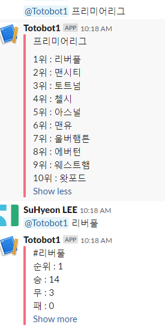
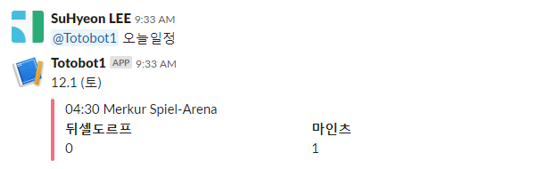
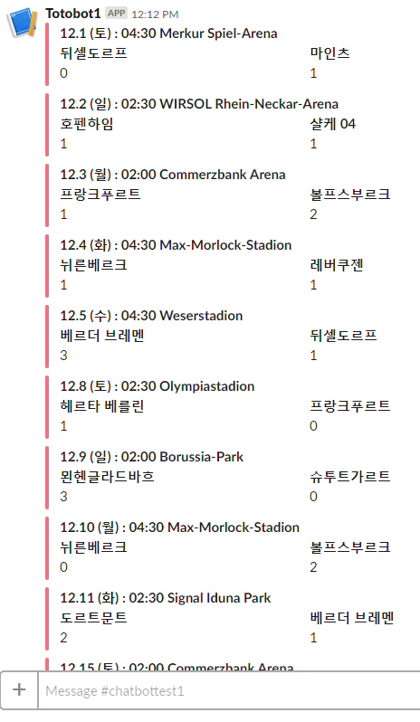

# sportbot
### Slack 환경에서 사용할 수 있는 해외 축구 경기 일정 및 리그 결과를 볼 수 있는 챗봇입니다.
> ## slack이란?
> </img>
>
> 개발자용 아카이브 메신저로 Code Snippet 지원 및 Google Drive, Trello, GitHub 등이 연동 가능합니다.
> 이 밖에더 편리성을 증진시키는 API를 제공합니다.
## 주요 기술
> 언어 : python 3.7.2
>
> Beautiful Soup, Selenium 라이브러리를 사용한 네이버 스포츠 페이지 데이터 크롤링
>
## 실행화면
> ```
> -----SportBot 1.1-----
> 1. 리그 순위 확인
> 프리미어리그
> 분데스리가
> 라리가
> 세리에A
> -> 리그 이름을 입력 ex)프리미어리그
> 
> 2. 팀 실적 확인
> ->자세한 실적을 보고 싶은 팀 이름을 입력
> ex)리버풀
> 3. 오늘 일정 확인
> ->오늘 일정을 확인하고 싶은 리그를 입력
> ex)프리미어리그 오늘일정
> 4. 전체 일정 확인
> ex) 전체일정
> ```
> ### 1. 리그 순위 확인 및 팀 실적 확인
> ***
> 
>
> ### 2. 오늘 일정 확인
> ***
> 
>
> ### 3. 전체 일정 확인
>***
> 
>
